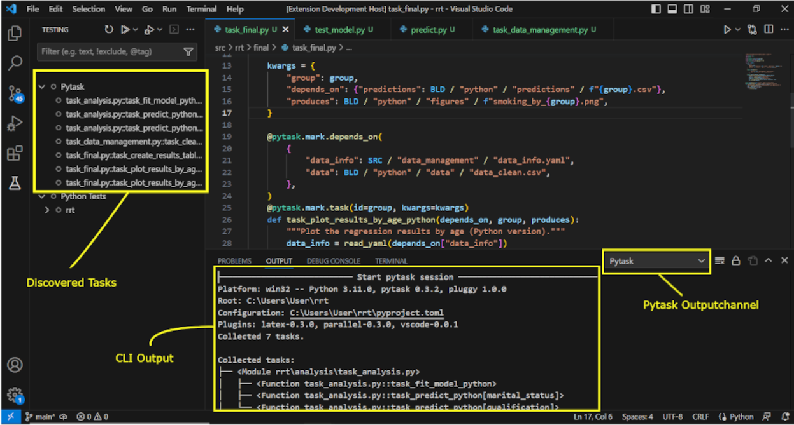
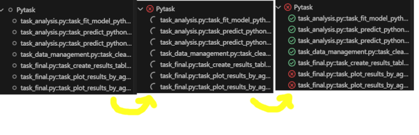

# Pytask VS Code Extension
The Extension integrates Pytask into the VS Code Test Explorer. It will discover all tasks inside the current working folder and you will be able to run them all at once by clicking "Run Pytask" inside the Test Explorer UI. The result of each task will be updated once a task is finished. The Pytask Output will appear as the Result of the Test Run. You can select your preferred way to input command line options in the extension settings.


## Installation
1. Search for Pytask in the Extension Marketplace and install it.
2. Add the pytask-vscode plugin from https://test.pypi.org/project/pytask-vscode/ to your python environment. Or use the pip command: ```pip install -i https://test.pypi.org/simple/ pytask-vscode```

## Requirements
Requires VS Code Python Extension and a python environment that has pytask and pytask-vscode installed.

## How to use the Extension

1. The tasks that Pytask collected in your currently opened folder will be displayed as test items once you open the testing tab. You can find the CLI Output from Pytask by selecting the Pytask Channel in the Output Channel dropdown menu. Refresh the list with the Refresh Button.



2. Select 'Run Pytask' to only run the tasks and ignore all other tests in the project. If you selected 'textpromt' or 'list' in the extensions settings, you will be asked to input your desired command line options. One by one the tasks will update their status.



3. Once all the tasks have finished the Pytask CLI output will be displayed in the Test Results Tab. In the end the extension should look like this.


