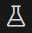
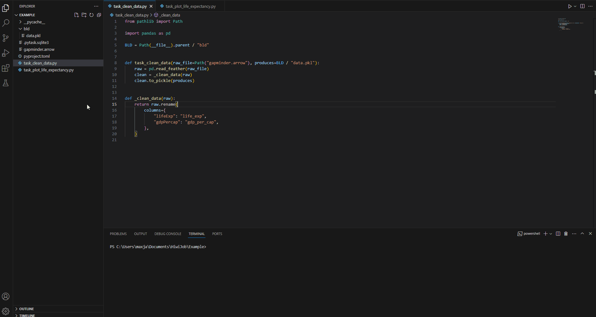
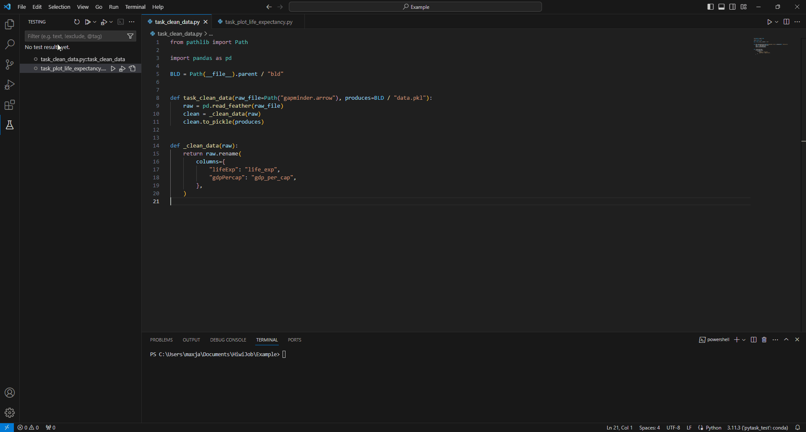

# Pytask Extension
This Extension integrates Pytask into the VS Code Test Explorer. It collects all tasks in the currently opened folder and gives the user the ability to run them with the simple click of a button.

## Installation
1. Search for Pytask in the Extension View of VSCode and install the extension. 
2. Use ```pip install pytask-vscode``` to install the pytask vscode plugin.

## First Steps
1. Open the folder that contains your pytask project in VSCode.
2. Select the python environment where you installed the plugin as your current interpreter.
3. Open VSCodes's Testing View. 
4. Wait for the Tasks to load.
5. Click the Run Tests Button at the top of the Testing View.
6. Inspect the results in the Test Results Tab at the bottom. If you click on a failed Task, you will be shown a summary of what went wrong in that specific Task.



## Passing Command Line Arguments to Pytask
There are two ways to input command line arguments for your pytask run. Open the VSCode Settings and scroll down to the Pytask Extension Settings and select your preferred mode. 
- ```text``` : you will be prompted for a string containing your arguments, like in the terminal
- ```list``` : you will be presented with a list of all possible arguments
You will now be asked to input command line arguments each time you run pytask.

>[!Warning]
>Currently only arguments that need no further interaction with pytask are supported. For example ```--pdb``` or ```--trace``` don't work.



## Troubleshooting
Here you can find Tips for the most commonly occuring problems.
### What to do if my task are not showing up in the Test Explorer?
1. Check if you opened the right folder. If you work from a repository this should usually be the root folder of the project.
2. Check if you selected the right interpreter. You can click on the search bar at the top and then search for the command ```Python: Select Interpreter``` to change it.
3. Go to the Output Tab and select the Pytask Output Channel. If the collection of the tasks failed, you should see that in the collection report.
4. Check if Port 6000 is blocked by your firewall, the extension needs this port to communicate with pytask.
### What to do if my run never stops or gives a cryptic error message?
1. You can stop the run by clicking on the stop button next to where you started the run.
2. Go to the Output Tab and select the Pytask Output Channel. Sometimes information about the run can be found there.
3. Delete the ```.pytask.sqlite3``` file in your project directory.


